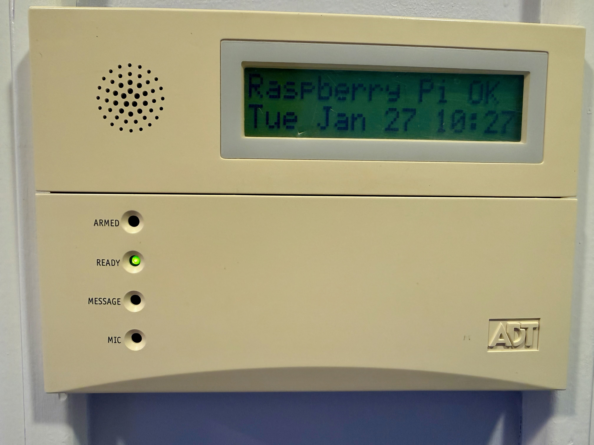
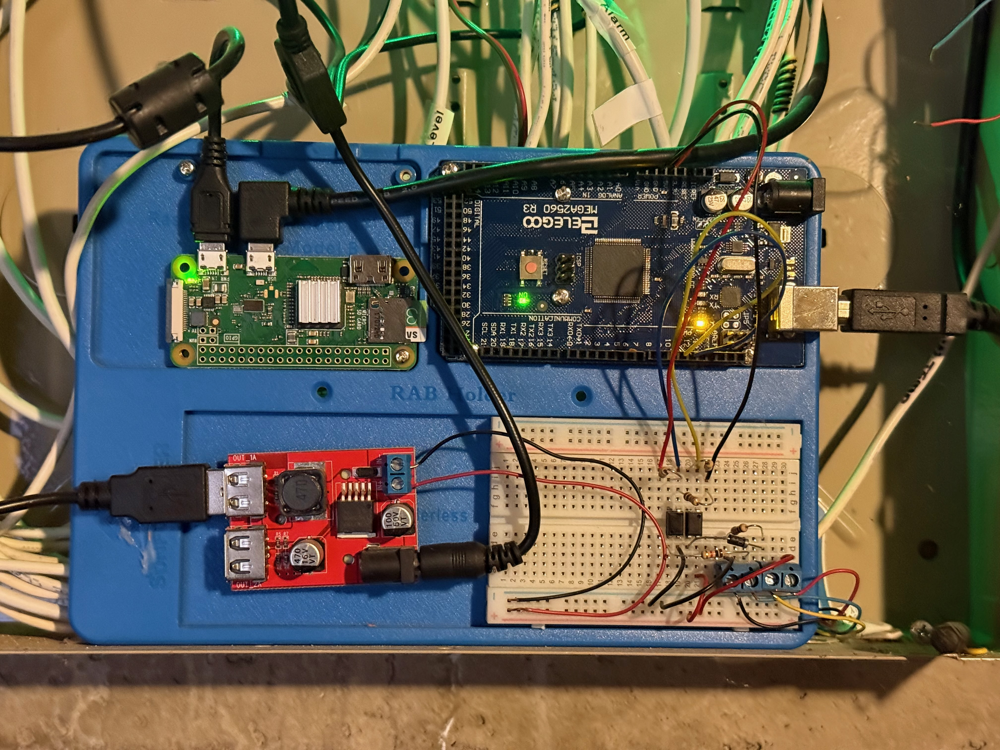

# 6160 Keypad MQTT Service

MQTT service for interfacing a Honeywell 6160 alarm keypad with HomeAssistant.

Requires an Arduino running [Arduino2keypad](https://github.com/TomVickers/Arduino2keypad) connected via USB serial.



## Usage

The service exposes three HomeAssistant entities via MQTT auto-discovery:

- **Keypad Mode** (select) -- Controls the keypad indicator LEDs and displays the mode on line 1 of the LCD. Options:
  - `Disarmed` -- READY LED lit, one chime
  - `Armed Away` -- ARMED LED lit, backlight off, two chimes
  - `Armed Stay` -- ARMED STAY LED lit, two chimes
- **Keypad Backlight** (light) -- Toggles the LCD backlight on or off.
- **Keypad Message** (text) -- Sends arbitrary text (up to 16 characters) to LCD line 1.

### Line 2 Notices

Line 2 rotates between active notices and the current date/time (always shown last). When no notices are active, it displays only the date/time.

Notices are managed via two MQTT topics:

- **`notice/set`** -- Add a notice to the rotation. Accepts plain text or JSON.
- **`notice/clear`** -- Remove a notice by its id or message text.

See [HA Automation Examples](#ha-automation-examples) below for usage.

## Hardware



A Raspberry Pi Zero W connects over USB serial to an Arduino Mega running [Arduino2keypad](https://github.com/TomVickers/Arduino2keypad). The Arduino handles the non-standard 4800 baud keypad bus protocol and exposes an F7 command interface over 115200 baud serial.

## Architecture


## Configuration

All settings are controlled via `KEYPAD_*` environment variables. See `quadlet/keypad6160.env` for the full list.

## Development

```bash
pip install -e ".[dev]"
git config core.hooksPath .githooks
pytest
```

## Container Build

```bash
podman build -t keypad6160:latest .
```

## Deploy (Raspberry Pi Zero W)

Flash Raspberry Pi OS Lite (Bookworm, 32-bit) to an SD card using
[Raspberry Pi Imager](https://www.raspberrypi.com/software/). Configure the
hostname (`raspberrypi-zerow`), WiFi, SSH, and user `pi` in the Imager settings.

After first boot, SSH in and run the setup script:

```bash
git clone https://github.com/brianegge/6160-st-device.git
cd 6160-st-device && bash setup.sh
```

The script installs podman, copies the quadlet files to
`~/.config/containers/systemd/`, enables the auto-update timer, and sets up
SNMP and backups. Review the env file for MQTT settings, then start the service:

```bash
systemctl --user start keypad6160
```

The container image is pulled from `ghcr.io/brianegge/keypad6160:latest` and
auto-updates via `podman auto-update`. Check for updates manually with:

```bash
podman auto-update --dry-run
```

## MQTT Topics

All topics are under the configurable prefix (default `homeassistant/6160`):

| Topic | Direction | Description |
|-------|-----------|-------------|
| `status` | publish | LWT: `online`/`offline` (retained) |
| `mode/set` | subscribe | Set alarm mode (e.g. `Armed Away`) |
| `mode/state` | publish | Current mode (retained) |
| `backlight/set` | subscribe | `ON` or `OFF` to toggle LCD backlight |
| `backlight/state` | publish | Current backlight state (retained) |
| `message/set` | subscribe | JSON: `{"text", "line_no", "backlight"}` |
| `message/1/set` | subscribe | Plain text for LCD line 1 |
| `message/2/set` | subscribe | Plain text for LCD line 2 |
| `notice/set` | subscribe | Add a notice to the line 2 rotation (see below) |
| `notice/clear` | subscribe | Remove a notice by id or message text |
| `tone/set` | subscribe | Play a tone (`0`–`7`), auto-resets after 1.5 s |
| `reset/set` | subscribe | Reset the Arduino via DTR toggle |
| `key/event` | publish | Keypress event: `{"event_type":"key_press","key":"5"}` |
| `uptime/state` | publish | Uptime in seconds (updated every 60 s) |

### Notice Payloads

The `notice/set` topic accepts two payload formats:

**Plain text** -- adds a transient notice that auto-expires after 60 seconds:
```
Doorbell Ring
```

**JSON** -- for persistent notices or custom TTL:
```json
{"id": "washer", "message": "Washer Done"}
```

| Field | Required | Default | Description |
|-------|----------|---------|-------------|
| `message` | yes | | Text to display (max 16 characters) |
| `id` | no | *message* | Unique identifier used to update or clear the notice |
| `ttl` | no | 0 if `id` given, 60 otherwise | Seconds until auto-expire; 0 = no expiry |

The `notice/clear` topic accepts the notice id (or message text) as a plain-text payload.

## HA Automation Examples

### Persistent notice (cleared by a second automation)

```yaml
# Notify when the washer finishes
- alias: "Notify washer done"
  triggers:
    - trigger: state
      entity_id: sensor.washer_state
      to: "complete"
  actions:
    - action: mqtt.publish
      data:
        topic: homeassistant/6160/notice/set
        payload: '{"id": "washer", "message": "Washer Done"}'

# Clear when the laundry room door opens
- alias: "Clear washer notice"
  triggers:
    - trigger: state
      entity_id: binary_sensor.laundry_door
      to: "on"
  actions:
    - action: mqtt.publish
      data:
        topic: homeassistant/6160/notice/clear
        payload: "washer"
```

### Transient notice (auto-expires in 60 seconds)

```yaml
- alias: "Doorbell ring notice"
  triggers:
    - trigger: state
      entity_id: binary_sensor.doorbell
      to: "on"
  actions:
    - action: mqtt.publish
      data:
        topic: homeassistant/6160/notice/set
        payload: "Doorbell Ring"
```

### Custom TTL

```yaml
- alias: "Garage open warning"
  triggers:
    - trigger: state
      entity_id: cover.garage_door
      to: "open"
      for: "00:05:00"
  actions:
    - action: mqtt.publish
      data:
        topic: homeassistant/6160/notice/set
        payload: '{"id": "garage", "message": "Garage Open", "ttl": 300}'
```
